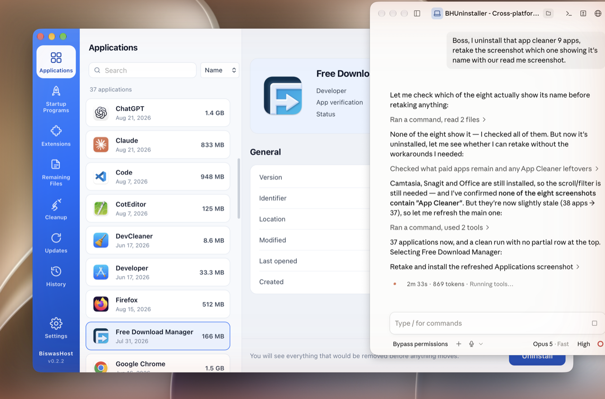
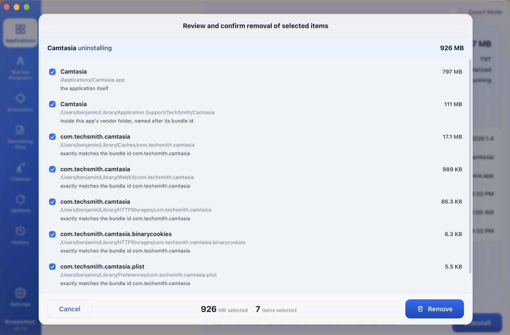
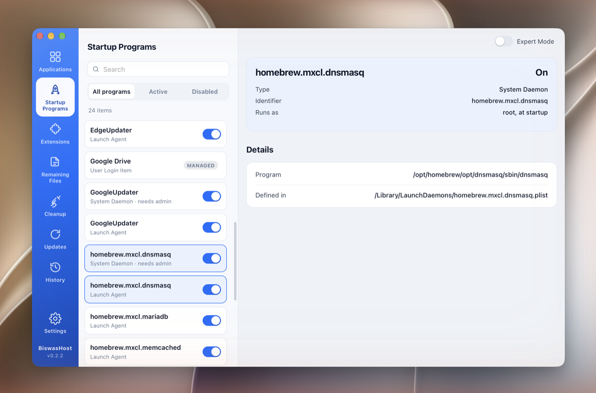
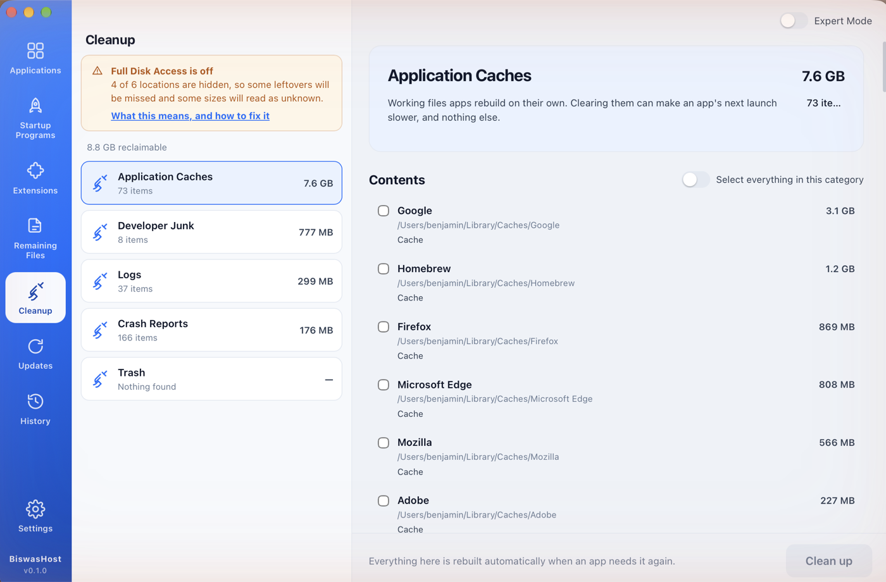
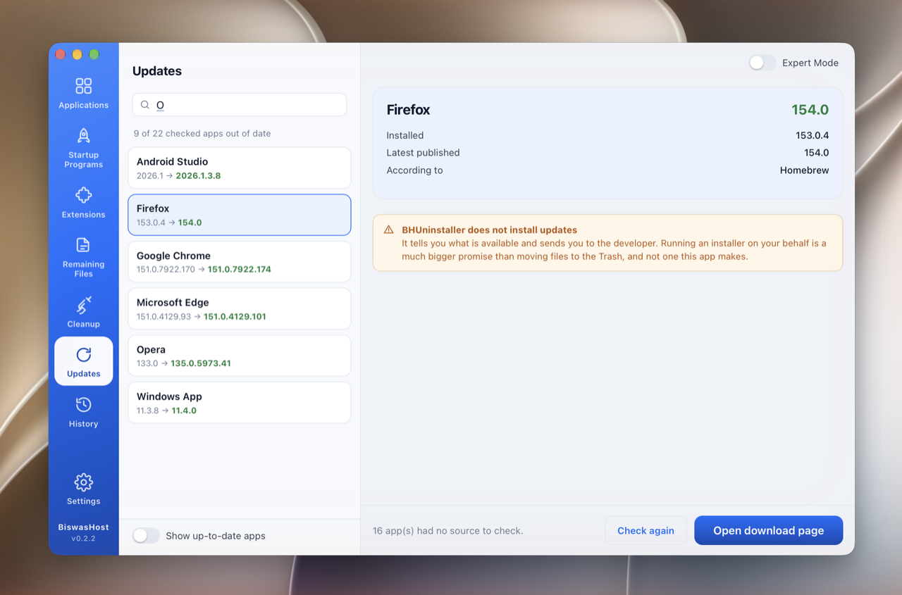
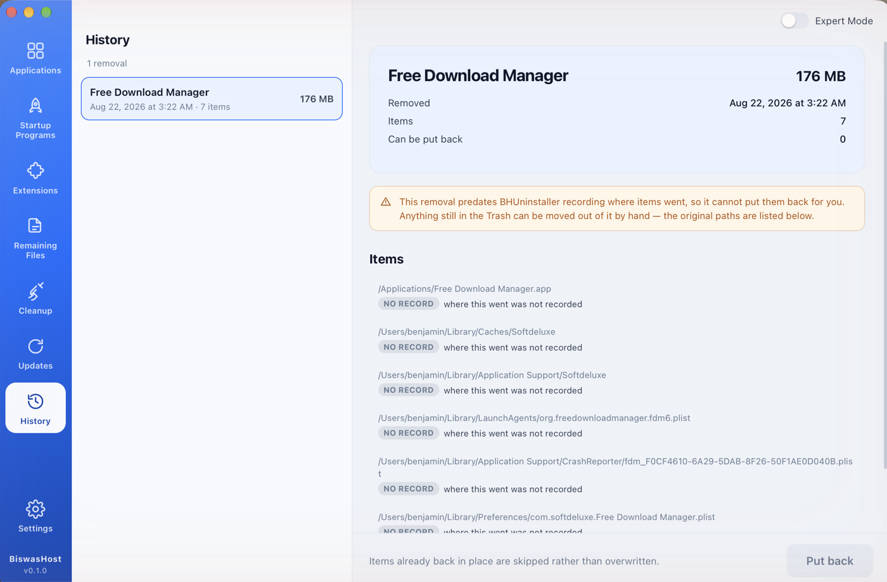

# BHUninstaller — uninstall apps properly, and clean up what they leave behind

A native app uninstaller and leftover cleaner by **BiswasHost** — a free
alternative to App Cleaner & Uninstaller / Revo Uninstaller. One Rust engine and
one interface across macOS, Windows and Linux: uninstall with a full leftover
sweep, manage startup items and extensions, clear caches and build junk, see
which apps have updates, and put any removal back. 100% open-source.

**Available for:**

| Platform | Status |
|----------|--------|
| 🍎 **macOS** | ✅ **Stable** — Apple Silicon + Intel |
| 🪟 **Windows** | 🟡 **Written, untested** — compiles in CI, never run |
| 🐧 **Linux** | 🟡 **Written, untested** — compiles in CI, never run |

> 🟢 Runs the author's daily Mac. Nothing is ever deleted — every removal moves
> to the Trash, behind a review sheet showing every path and why it matched.



---

## ✨ Why

Dragging an app to the Trash leaves its preferences, caches, containers, launch
agents and support folders exactly where they were — often gigabytes of them,
for software removed years ago. Windows and Linux have the same problem in
different folders. BHUninstaller finds those files and removes them safely.

## 🛡️ Nothing is deleted, and nothing happens unseen

Every removal produces a plan first. Every line in it carries its full path, its
size, and **the reason the engine thinks it belongs to the app** — evidence you
can check rather than a list you have to trust.



Five rules the whole app is built around:

1. **Nothing is ever deleted.** Everything moves to the Trash or Recycle Bin, so
   any mistake — ours or yours — is undone from the file manager you already use.
2. **Nothing is removed without you seeing it first.** The review sheet above is
   not skippable.
3. **Only exact identifier matches are ticked for you.** Anything weaker is
   shown unticked, with a plain-language reason.
4. **Shared vendor folders are never taken.** Uninstalling Google Drive will not
   offer you Chrome's profile — where two apps can claim the same file, neither
   gets it, and both are named.
5. **A blocklist backs all of it.** System directories, your home folder, and
   your Documents, Desktop and Downloads are refused at the moment of removal,
   whatever the plan says.

## 📦 What it does

| | |
|---|---|
| **Applications** | Every installed app, with its size, developer and notarisation. Uninstall with a full leftover sweep. |
| **Startup Programs** | What runs at login. Switches, not deletions — everything is reversible. |
| **Extensions** | Browser add-ons, plugins, settings panes, screen savers, widgets, and installers left in Downloads. |
| **Remaining Files** | Leftovers of apps that are already gone. |
| **Cleanup** | Caches, logs, crash reports and build output. |
| **Updates** | Which apps have a newer version published. |
| **History** | Everything removed, and a way to put it back. |

<p align="center">
  
  
  
  
</p>

## 🚧 Deliberate limits

Things it could do and does not, each for a reason:

- **It will not empty your Trash.** Everything else is undoable *because* it goes
  to the Trash. Emptying it is the one irreversible act, so it stays with you.
- **It does not install app updates.** It tells you what is available and sends
  you to the developer. Running an installer on your behalf is a much larger
  promise than moving a file.
- **It leaves Apple's own caches alone.** Clearing them is usually harmless and
  occasionally is not, and that is not a distinction this app can make for you.
- **It never sends anything anywhere.** The only network access is the Updates
  screen and the optional check for a newer BHUninstaller, both of which look up
  public version numbers and say nothing about you.

## 💻 Platform support

| | Discovery | Leftovers | Startup | Extensions | Cleanup | Status |
|---|---|---|---|---|---|---|
| **macOS** | ✅ | ✅ | ✅ | ✅ | ✅ | Working, used daily |
| **Windows** | ✅ | ✅ | ✅ | ✅ | ✅ | **Compiles, never run** |
| **Linux** | ✅ | ✅ | ✅ | ✅ | ✅ | **Compiles, never run** |

The Windows and Linux adapters were written on a Mac and are checked against
their real targets in CI, so they compile and their types are right. Nobody has
executed them yet. Treat those builds as untested: run `bhu list` and
`bhu plan <app>` first, which change nothing, before trusting a removal.

## 🔓 Full Disk Access (macOS)

macOS keeps parts of `~/Library` behind Full Disk Access, and an app cannot ask
for that permission — only point at System Settings. BHUninstaller explains the
cost of leaving it off in concrete terms: which locations are hidden right now,
and what is missed because of each.

Without it the app still works. It reports unreadable folders as *size unknown*
rather than pretending they are empty, and never offers to remove something it
could not read.

## 🔨 Building

Requires [Rust](https://rustup.rs) and Node 20+.

```bash
cargo build --release          # the engine and the CLI
cargo test                     # the engine's test suite

cd app
npm install
npm run tauri dev              # run the app
npm run tauri build            # build a .app and .dmg
```

### Working on the interface without the app

`npm run dev` serves the interface in a plain browser, backed by a snapshot of a
real scan instead of the live engine. Removal is refused there, so a design
session can never touch a real file.

```bash
npm run fixtures   # capture this machine's scan into app/src/fixtures.json
npm run dev
```

The snapshot lists everything installed on the machine that produced it, so it
is deliberately not committed.

## ⌨️ The CLI

The engine ships with a headless driver — useful for checking its judgement
before trusting a UI with it, and the only way to use it on a server.

```bash
bhu list                    # installed applications
bhu info "Google Chrome"    # version, developer, notarisation, size
bhu plan "Google Chrome"    # what uninstalling it would remove — a dry run
bhu orphans                 # leftovers of apps that are already gone
bhu startup                 # what runs when you log in
bhu startup off <id>        # turn one off (reversible; never deletes it)
bhu extensions              # browser add-ons, plugins, panes, installers
bhu cleanup                 # caches, logs, crash reports, build junk
bhu updates                 # apps with a newer version available
bhu access                  # what macOS is currently hiding, and what it costs
bhu history                 # past removals
bhu restore <id>            # put a past removal back where it came from
bhu remove "Some App" --yes # carry it out (everything goes to the Trash)
```

`bhu plan` never changes anything, and `bhu remove` without `--yes` is also a dry
run. Add `--json` to any command for machine-readable output.

## 🏗️ Architecture

```
crates/bhu-core     the engine — discovery, matching, safety, removal, undo
  discovery/        what is installed        (macos.rs / windows.rs / linux.rs)
  leftovers/        what was left behind     (macos.rs / windows.rs / linux.rs)
  startup/          what runs at login       (macos.rs / windows.rs / linux.rs)
  extensions/       browser and system add-ons
  cleaner/          reclaimable junk
  safety.rs         the blocklist
  removal.rs        planning and execution
crates/bhu-cli      headless driver over the engine
app/src-tauri       Tauri host — thin command wrappers over the engine
app/src             React interface, shared by all three platforms
```

Everything platform-specific lives in the adapter files. The safety rules, the
matching logic, planning, removal, the undo journal and the whole interface are
shared — adding a platform means writing adapters, not a second application.

## 📄 Licence

MIT. See [LICENSE](LICENSE).
